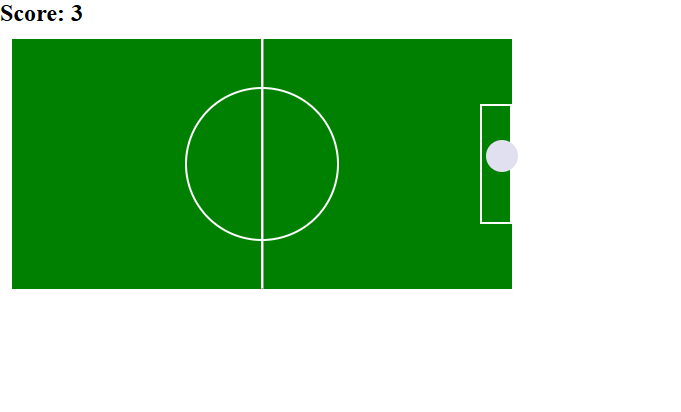

# ⚽ Football Field Task

This is a fun interactive mini-game built with HTML, CSS, and JavaScript. Click anywhere on the football field, and the ball will move smoothly to that position. If the ball lands inside the goalpost, the score increases. 

---

## 🛠 Features

- ✅ Score tracking each time the ball enters the goal
- ✅ Collision detection to determine if the ball is in the goalpost
- ✅ Responsive click handling using `clientX` / `clientY`
- ✅ Ball stays within the field bounds
- ✅ Works even after page scroll
- ✅ Custom UI for field, ball, and post

---

## 🧠 How it works

- On each field click, the ball moves to the click position.
- Collision logic checks if the ball overlaps with the goalpost.
- If true, score counter increases 

---

## 📦 Tech Stack

- HTML5
- CSS3 
- Vanilla JavaScript (DOM manipulation and event handling)

---

## 🚀 Getting Started

To run the project locally:

1. Clone this repo:
   ```bash
   git clone https://github.com/PetJs/football-field-task.git
2. Navigate to the folder:
    ```bash
    cd football-field-task
3. Open index.html in your browser:
    ```bash
    start index.html

## 📸 Preview



## 🎯 Future Improvements

1. Add sound effects when scoring

2. Add a goal animation or scoreboard celebration

3. Add a goalkeeper obstacle

4. Create a two-player mode

## Deployed Link
👉[football-field-task](https://football-field-task.vercel.app/)